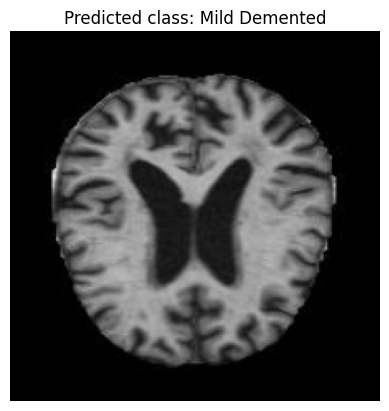
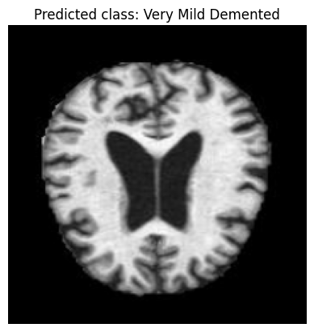
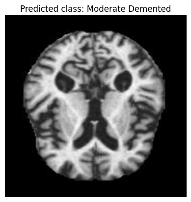

# Alzheimer's Prediction Using Machine Learning

This repository contains code and resources for predicting Alzheimer's disease using machine learning techniques.

## Overview

Alzheimer's disease is a neurodegenerative disorder that affects millions worldwide. Early detection can significantly impact treatment efficacy. This project explores the use of machine learning algorithms to predict Alzheimer's disease based on demographic, genetic, and clinical data.

## Dataset

The dataset used in this project consists of [describe your dataset briefly]. It includes [number of samples] samples with [number of features] features. Preprocessing steps included [briefly describe preprocessing steps]. 
link for data sets:https://www.kaggle.com/datasets/uraninjo/augmented-alzheimer-mri-dataset

## Methods

Machine learning algorithms used in this project include:
- Data preprocessing (e.g., normalization, handling missing values)
- Model selection and training
- Performance metrics used for evaluation

## Results

### Output Images

**Prediction Example**: Example of a prediction made by the model.
   
   
   
   
   
   

## How to Use

To run the code:

1. Clone this repository:
git clone https://github.com/ChikkaLokeshPrasad/Alzheimer-Disease-Prediction-using-ML.git
cd alzheimers-prediction

2. Run the code:
python Alzheimer.ipynb

