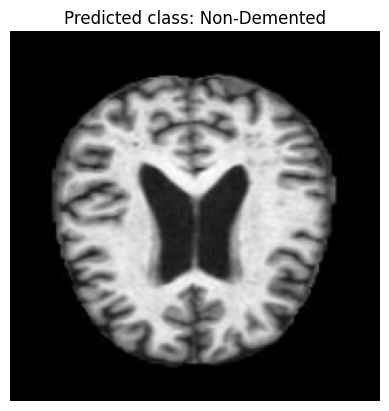

# Alzheimer's Prediction Using Machine Learning

This repository contains code and resources for predicting Alzheimer's disease using machine learning techniques.

## Overview

Alzheimer's disease is a neurodegenerative disorder that affects millions worldwide. Early detection can significantly impact treatment efficacy. This project explores the use of machine learning algorithms to predict Alzheimer's disease based on demographic, genetic, and clinical data.

## Dataset

The dataset used in this project consists of MRI scans and related clinical information. It includes several samples with multiple features, capturing various aspects of patient data. Preprocessing steps included normalization, handling missing values, and feature extraction.

Link to the dataset: [Augmented Alzheimer MRI Dataset](https://www.kaggle.com/datasets/uraninjo/augmented-alzheimer-mri-dataset)

## Methods

Machine learning algorithms used in this project include:
- Data preprocessing (e.g., normalization, handling missing values)
- Model selection and training
- Performance metrics used for evaluation

## Results

### Output Images

**Prediction Examples**: Examples of predictions made by the model.





## How to Use

To run the code:

1. Clone this repository:
   ```bash
   git clone https://github.com/nehareddy747/alzheimer-disease-prediction.git
   cd Alzheimer-Disease-Prediction-using-ML
   ```

2. Run the code:
   python Alzheimer.ipynb
   ```bash
   jupyter notebook Alzheimer.ipynb
   ```
