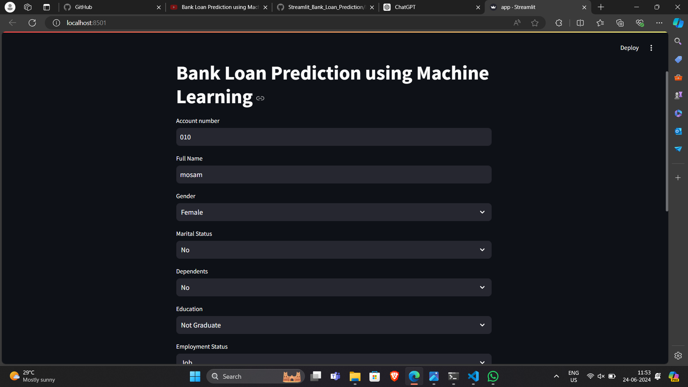
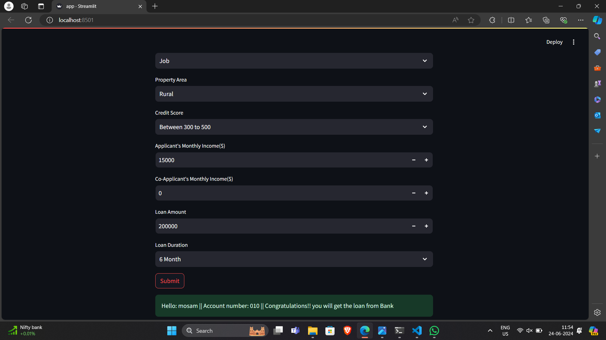

# Bank Loan Prediction

## Project Overview

The Bank Loan Prediction project aims to develop a machine learning model to predict the likelihood of a loan applicant being approved for a loan. The project utilizes various data processing and machine learning techniques to analyze applicant data and make predictions.

## Project Structure
.
├── Bank_Loan_Prediction.py
├── requirements.txt
└── Str_Loan_ML.ipynb

### Files Description

- *Bank_Loan_Prediction.py*: This script contains the main code for the bank loan prediction model, including data preprocessing, model training, and prediction functions.
- *requirements.txt*: This file lists all the dependencies and libraries required to run the project.
- *Str_Loan_ML.ipynb*: A Jupyter notebook that provides an interactive environment for developing and testing the machine learning model, including data exploration, visualization, and model evaluation.

## Requirements

To run this project, you need to have the following libraries installed. You can install them using the requirements.txt file:

pip install -r requirements.txt
Dependencies
scikit-learn==0.22.1
numpy
pandas
matplotlib
streamlit==0.76.0
Pillow
seaborn

## Usage
Running the Jupyter Notebook
Open the Str_Loan_ML.ipynb file in Jupyter Notebook or JupyterLab.
Follow the steps in the notebook to preprocess the data, train the model, and evaluate its performance.
Running the Python Script
Ensure you have installed all the required dependencies listed in the requirements.txt.
Run the Bank_Loan_Prediction.py script using the following command:

python Bank_Loan_Prediction.py

## Data Description :
The dataset used for this project includes various features about loan applicants, such as:

Applicant's income
Loan amount
Loan term
Credit history
Property area
Education
Marital status
The target variable is whether the loan application was approved or not.

## Model Evaluation :
The model's performance is evaluated using appropriate metrics such as accuracy, precision, recall, and F1-score. Visualization tools like confusion matrix and ROC curves are also used to assess the model's effectiveness.

## Streamlit Application :
A simple web application is built using Streamlit to allow users to input applicant data and get loan approval predictions. To run the Streamlit app, use the following command:

streamlit run app.py

## OUTPUTS -

