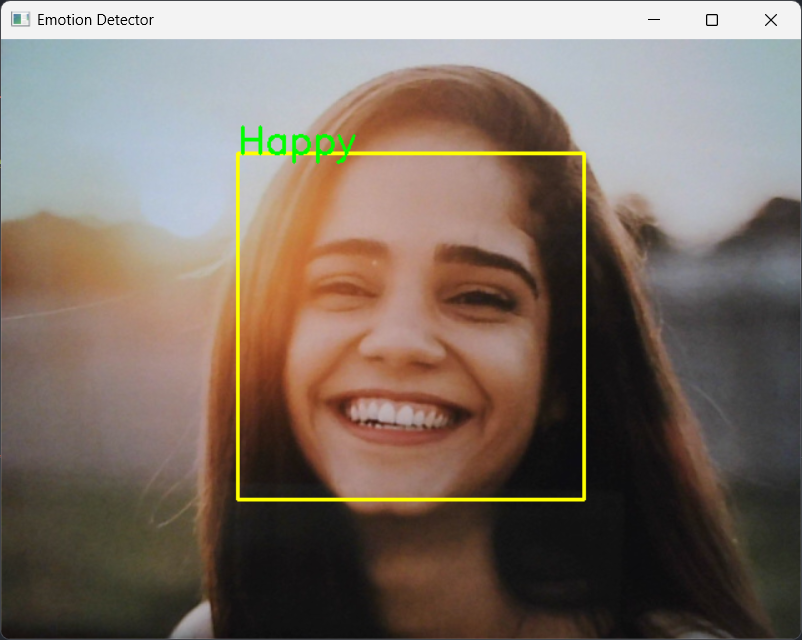
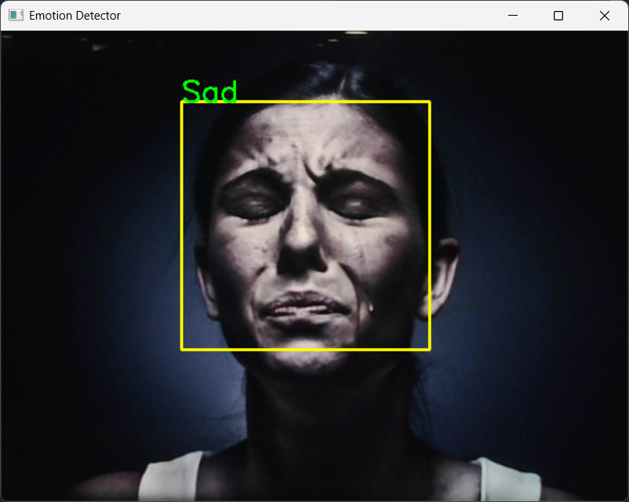
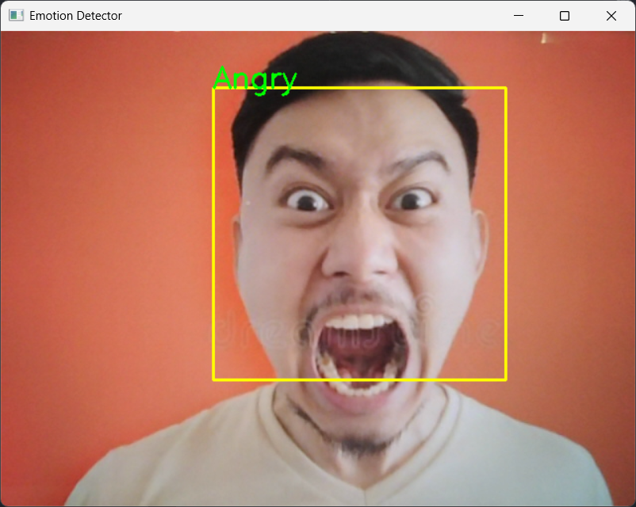
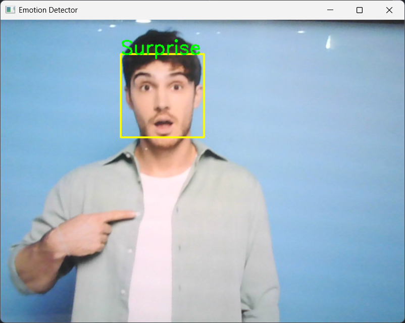

# Facial Expressions Recognition


This project implements a Facial Expressions Recognition system using a Convolutional Neural Network (CNN). The system can identify seven different expressions: Angry, Disgust, Fear, Happy, Neutral, Sad, and Surprise.

## Table of Contents

- [Overview](#overview)
- [Libraries Used](#libraries-used)
- [Dataset](#dataset)
- [Installation](#installation)
- [Training the Model](#training-the-model)
- [Running the Model](#running-the-model)
- [Results](#results)
- [Acknowledgments](#acknowledgments)
- [License](#license)

## Overview

Facial expression recognition is a significant area in computer vision with applications in various fields such as human-computer interaction, behavior analysis, and emotion AI. This project uses a deep learning approach to detect faces and classify their expressions in real-time.

## Libraries Used

- **NumPy**: For numerical operations and handling arrays.
    - Used to handle image data and convert them into arrays suitable for input into the CNN model.
- **Pandas**: For data manipulation and analysis.
    - Utilized for managing the dataset metadata, although not heavily used in this specific implementation.
- **Matplotlib** & **Seaborn**: For plotting graphs, visualizing data and for statistical data visualization.
    - Employed to visualize the training process, including loss and accuracy curves.
- **OpenCV**: For real-time computer vision tasks like face detection.
    - Integral for capturing video feed from the webcam and detecting faces using Haar cascades.
- **Keras**: For building and training deep learning models, with TensorFlow as the backend.
    - Used to define, compile, and train the CNN model. The `ImageDataGenerator` from Keras is used for preprocessing image data.

## Dataset

The dataset used for this project consists of images of faces with different expressions. Each image is converted to grayscale and resized to 48x48 pixels. The dataset is organized into training and validation sets.

## Installation

1. **Clone the Repository**:

    ```bash
    git clone https://github.com/RamNaresh21/facial-expressions-recognition.git
    cd facial-expression-recognition
    ```

2. **Install Dependencies**

    ```bash
    pip install numpy pandas matplotlib seaborn opencv-python keras
    ```

## Training the Model

1. **Open the Notebook**:

    ```bash
    jupyter notebook emotion-classification-cnn-model.ipynb
    ```

2. **Follow the Steps**:
- Load and preprocess the dataset.
- Define and compile the CNN model.
- Train the model using the training set.
- Save the trained model as model.h5.

## Running the Model

You can run the real-time facial expression recognition using the `main.py` script:

   ```bash
   python main.py
   ```

## Results

After training the model, you can visualize the training performance:

- Loss and Accuracy Curves:

    The notebook plots the training and validation loss and accuracy over epochs, helping to understand how well the model is learning.

## Outputs






## Acknowledgments

- The `haarcascade_frontalface_default.xml` file is a part of the OpenCV library used for face detection.
- The CNN model is built and trained using Keras with TensorFlow backend.
