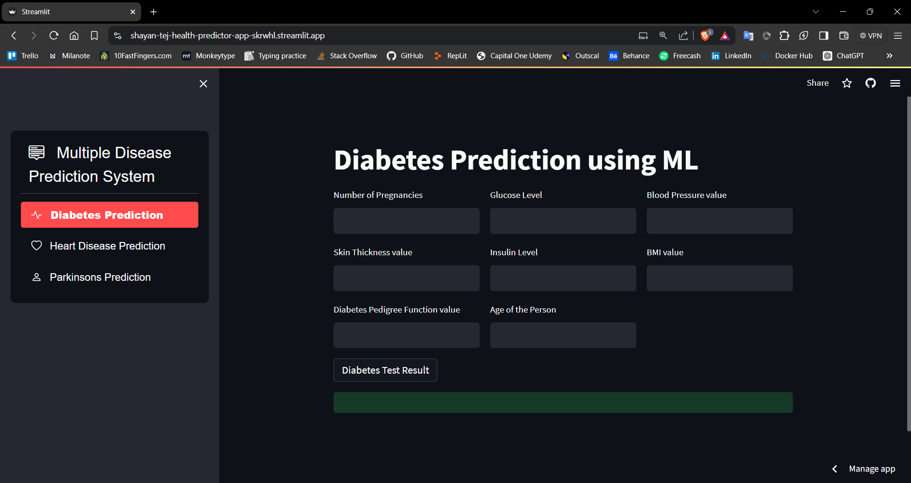
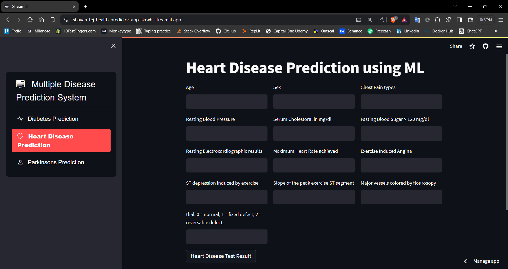
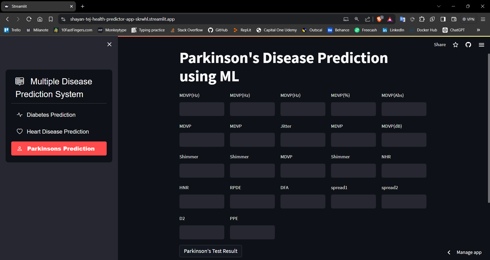

# Health Predictor Web App


## Overview

The **Health Predictor Web App** is a machine learning-powered tool designed to predict the likelihood of **Diabetes**, **Heart Disease**, and **Parkinson's Disease** based on patient-provided information. This web application features a user-friendly interface built with Streamlit, providing easy-to-understand predictions and statistical insights.





## Web App link
[Health-Predictor-Streamlit.app](https://shayan-tej-health-predictor-app-skrwhl.streamlit.app/)

## Features

- **Multiple Health Predictions**: Estimates the risk for Diabetes, Heart Disease, and Parkinson's.
- **Interactive Form**: Collects patient information through an easy-to-use form.
- **Statistical Insights**: Displays clear, statistical results for each prediction.
- **Visualizations**: Graphical representations to enhance understanding of the results.

## Technologies Used

- **Python**: Core programming language.
- **Pandas**: Data manipulation and analysis.
- **Scikit-Learn**: Machine learning model implementation.
- **Matplotlib**: Data visualization.
- **Streamlit**: Web application framework.

## Installation

1. **Clone the Repository**

    ```bash
    git clone https://github.com/shayan-tej/health-predictor.git
    cd health-predictor
    ```

2. **Create a Virtual Environment (Optional but recommended)**

    ```bash
    python -m venv venv
    source venv/bin/activate  # On Windows use `venv\Scripts\activate`
    ```

3. **Install Dependencies**

    ```bash
    pip install -r requirements.txt
    ```

4. **Run the Application**

    ```bash
    streamlit run app.py
    ```

## Usage

1. **Input Data**: Enter your health-related information such as age, glucose levels, heart rate, etc.
2. **Get Predictions**: Click the "Predict" button to see the likelihood of having Diabetes, Heart Disease, or Parkinson's Disease.
3. **View Results**: Check the statistical and graphical results provided by the app.

## Project Structure

```plaintext
health-predictor/
│
├── data/
│   ├── diabetes.csv           # Dataset for diabetes prediction
│   ├── heart.csv              # Dataset for heart disease prediction
│   ├── parkinsons.csv         # Dataset for Parkinson's prediction
│   └── ...                    # Any additional data files
│
├── jupyter files/
│   ├── Diabetes.ipynb         # Pre-trained model for diabetes prediction
│   ├── Heart.ipynb            # Pre-trained model for heart disease prediction
│   ├── Parkinsons.ipynb       # Pre-trained model for Parkinson's prediction
│   └── ...                    # Any additional model files
│
├── Saved-models/
│   ├── diabetes_model.pkl     # Pre-trained model for diabetes prediction
│   ├── heart_model.pkl        # Pre-trained model for heart disease prediction
│   ├── parkinsons_model.pkl   # Pre-trained model for Parkinson's prediction
│   └── ...                    # Any additional model files
│
├── Screenshots/                # App screenshots
├── app.py                      # Streamlit application script
├── requirements.txt            # Python dependencies
├── README.md                   # Project README file
└── MIT LICENSE                 # License file
