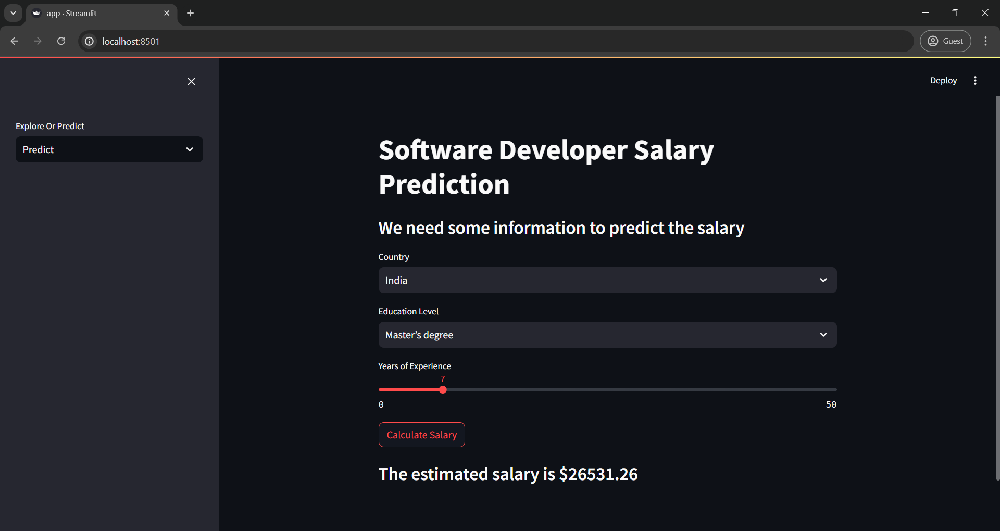
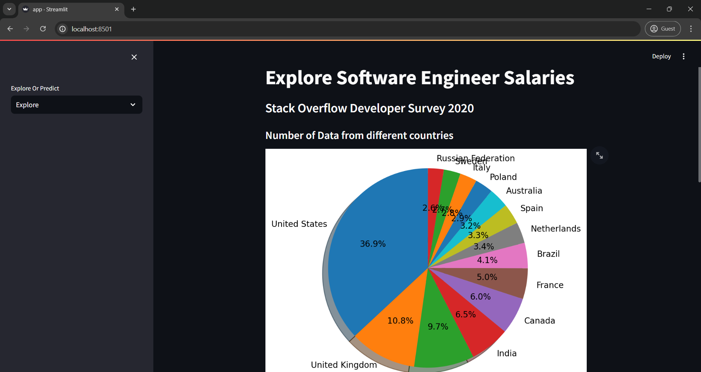

# Employee Salary Predictor

## Overview

Employee Salary Estimator is a web application that predicts the expected salary of employees based on their years of experience and education level. This application utilizes machine learning models to provide salary estimations, helping users make informed decisions regarding compensation expectations.

## Features

- **Interactive Interface**: User-friendly web interface powered by Streamlit.
- **Predictive Analysis**: Estimates salary based on user input of experience and education.
- **Visual Insights**: Displays graphical representations of the data and predictions.
- **Flexible Model**: Easily adaptable to different datasets and parameters.
