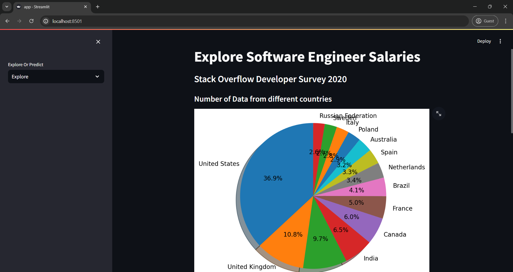
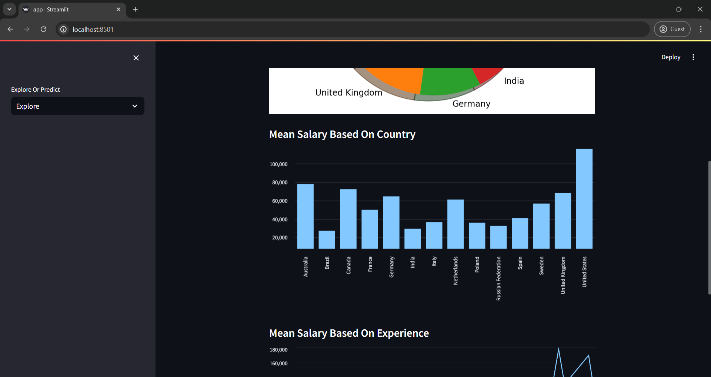
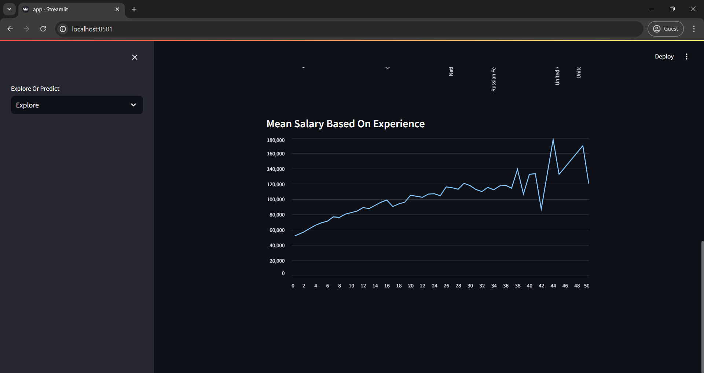

# Employee Salary Estimator


## Overview

Employee Salary Estimator is a web application that predicts the expected salary of employees based on their years of experience and education level. This application utilizes machine learning models to provide salary estimations, helping users make informed decisions regarding compensation expectations.






## Features

- **Interactive Interface**: User-friendly web interface powered by Streamlit.
- **Predictive Analysis**: Estimates salary based on user input of experience and education.
- **Visual Insights**: Displays graphical representations of the data and predictions.
- **Flexible Model**: Easily adaptable to different datasets and parameters.

## Technologies Used

- **Python**: The core programming language.
- **Pandas**: Data manipulation and analysis.
- **Scikit-Learn**: Machine learning model implementation.
- **Matplotlib**: Data visualization.
- **Streamlit**: Web application framework.

## Installation

1. **Clone the Repository**

    ```bash
    git clone https://github.com/yourusername/employee-salary-estimator.git
    cd employee-salary-estimator
    ```

2. **Create a Virtual Environment (Optional but recommended)**

    ```bash
    python -m venv venv
    source venv/bin/activate  # On Windows use `venv\Scripts\activate`
    ```

3. **Install Dependencies**

    ```bash
    pip install -r requirements.txt
    ```

4. **Run the Application**

    ```bash
    streamlit run app.py
    ```

## Usage

1. **Input Data**: Enter your years of experience and education level into the input fields.
2. **Predict Salary**: Click the "Predict" button to estimate your expected salary.
3. **View Results**: The predicted salary will be displayed, along with visual insights.

## Project Structure

```plaintext
employee-salary-estimator/
│
├── data/
│   ├── salary_data.csv         # Dataset file
│   └── ...                     # Any additional data files
│
├── models/
│   ├── salary_model.pkl        # Pre-trained model file
│   └── ...                     # Any additional model files
│
├── src/
│   ├── train_model.py          # Script to train the model
│   ├── predict_salary.py       # Script to make predictions
│   └── ...                     # Any additional source files
│
├── app.py                      # Streamlit application script
├── requirements.txt            # Python dependencies
├── README.md                   # Project README file
└── LICENSE                     # License file
