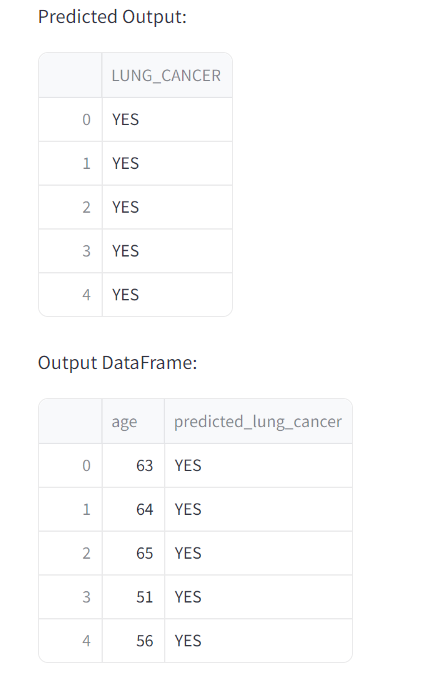
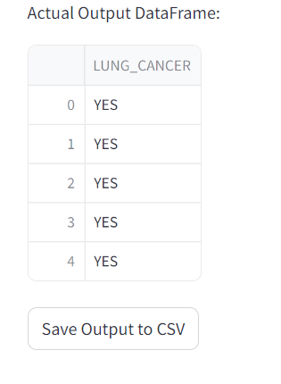

# Lung Cancer Prediction App

This Streamlit web application predicts the likelihood of lung cancer based on various features using a Decision Tree Classifier.

## Overview

The app consists of several components:

1. **Data Upload and Preprocessing:** Users can upload a CSV dataset containing information about individuals, which is then preprocessed to map categorical variables like gender and lung cancer status (YES/NO) to numerical values.

2. **Data Exploration:** Summary statistics of the dataset such as info, description, and the first few rows are displayed to provide insights into the data.

3. **Data Splitting:** The dataset is split into training and testing sets. Additionally, an output set (for final predictions) is separated from the test set.

4. **Model Training:** A Decision Tree Classifier is trained on the training set to learn patterns in the data.

5. **Model Evaluation:** The trained model predicts lung cancer status on the test set. Evaluation metrics such as Mean Absolute Error (MAE) and Accuracy Score are calculated and displayed.

6. **Prediction on Output Set:** The model then predicts lung cancer status on the output set. Predicted values are converted back from numerical to categorical (YES/NO).

7. **Display of Results:** Results including predicted output and actual values for comparison are shown. A final output dataframe is prepared and can be saved to a CSV file.

## Features Used for Prediction

- **Features:** GENDER, AGE, SMOKING, ANXIETY, CHRONIC DISEASE, CHEST PAIN, ALCOHOL CONSUMING, SHORTNESS OF BREATH
- **Target Variable:** LUNG_CANCER (mapped to 1 for NO and 2 for YES)

## Requirements

- Python 3.x
- Streamlit
- Pandas
- Scikit-learn

## How to Run the App

1. Clone the repository:

  ```Bash
  git clone https://github.com/AvinashRasala/lung-cancer.git
  cd your-repository
  ```

2. Install dependencies:

  ```Bash
  pip install -r requirements.txt
  ```

3. Run Streamlit App:

```Bash
streamlit run lungcancer.py
```

4. Upload your dataset (CSV format) and interact with the app to explore data, train the model, and make predictions.

## Usage

- Upload your dataset using the file uploader.
- Explore dataset information, preprocess categorical data, and split into training, testing, and output sets.
- Train the Decision Tree Classifier on the training set and evaluate its performance.
- Predict lung cancer status on the test set and output set.
- Save the predicted output to a CSV file if desired.

## Outputs




## Future Improvements

- Incorporate feature selection techniques to improve model performance.
- Deploy the app on a web server for wider accessibility.
- Enhance user interface and visualization of results.
  
## License

This project is licensed under the MIT License - see the [LICENSE](LICENSE) file for details.
